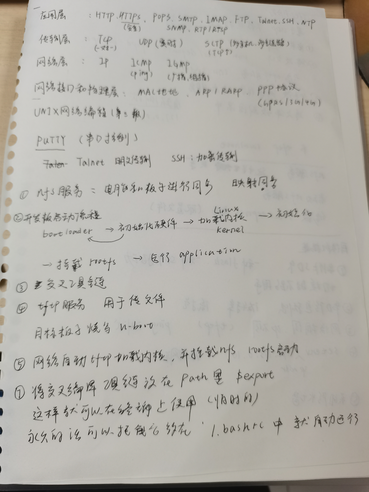
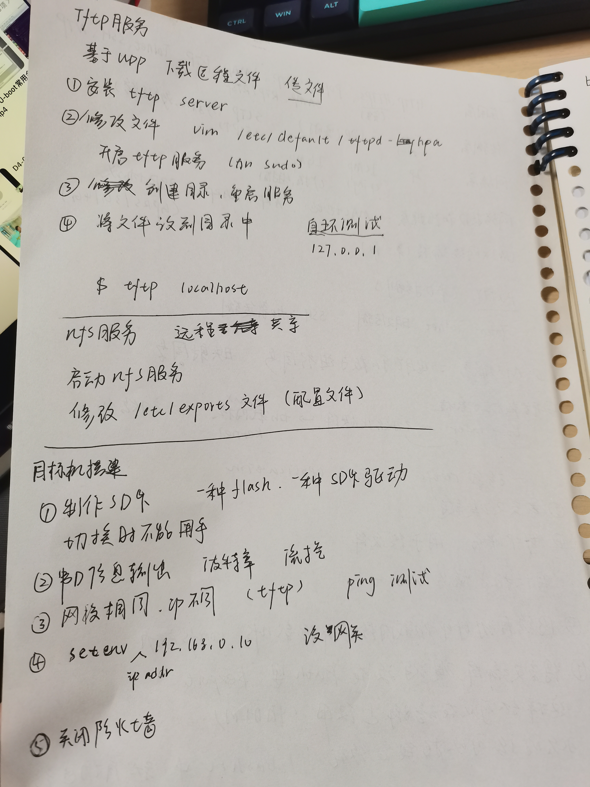
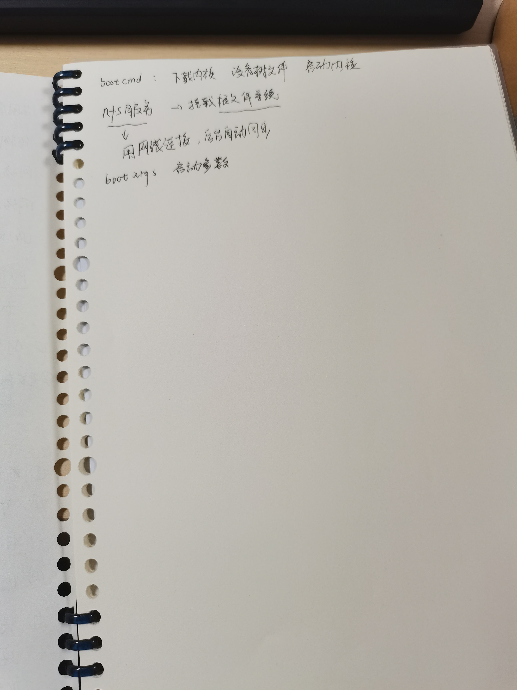

# 环境搭建

## 一、基本组成

- 开发主机
- 目标机
- 连接介质

## 二、开发板启动流程

bootloader  ->  初始化硬件   ->   加载内核linux  ->   初始化  ->   挂载rootfs   ->   运行application   

## 三、需要的内容

1. 交叉编译工具链 （因为需要在不同架构间编译的内容不同）
2. tftp服务 （用于传文件，例如目标板子烧写u-boot）
3. nfs服务（能够远程共享，能够进行实时共享）
4. 板子有SD卡启动和falsh启动

