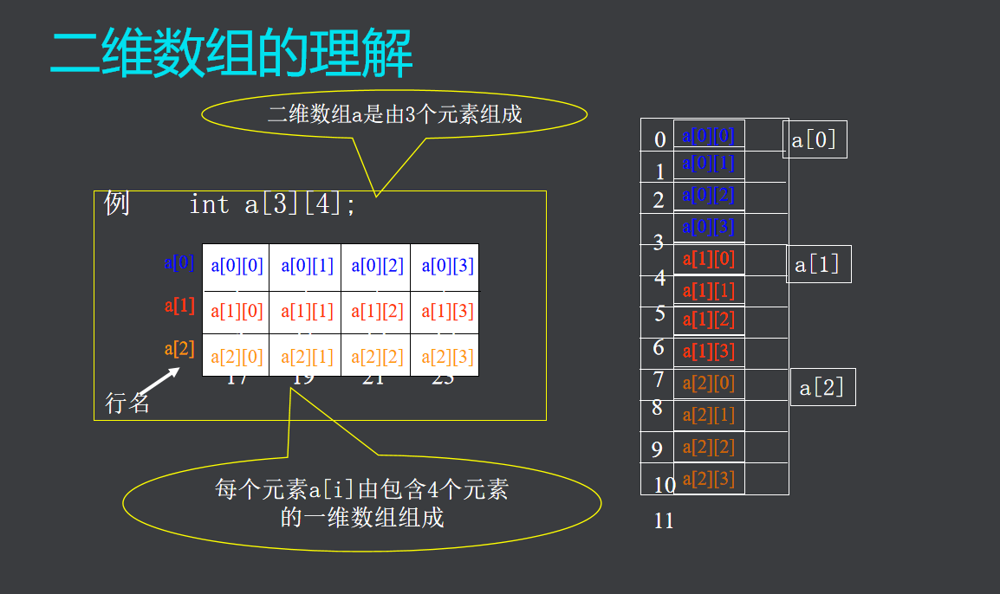
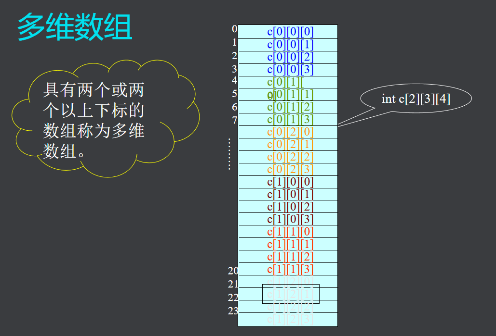

# **二维数组**

## 定义
- 格式：数据类型 数组名 [常量表达式][常量表达式];

## 存储特点
- 内存是一维的
- 按行序优先

int a[3][2]
分析：
1. 三行两列数组
2. a[0][0]~a[2][1]

对二维数组的理解

  

四个元素其实是一个一维数组

## 二维数组的引用
1. 形式：数组名[下标][下标]
2. 初始化
    - 分行初始化
    - 按元素排列顺序初始化
    - eg：int a[2][3]={{1,2},{4}}  
    1,2,0,4,0,0;  

注意：
1. 一般定义用{}里面嵌入{}；
2. 可以省略多少行，不可以省略**列数**；

## 多维数组
> 具有两个或两个以上下标的数组称为多维数组  

  

## 程序举例
杨辉三角题目  
  

```
#include<stdio.h>
int main()
{
	int a[10][10]={{0}};
	int i,j;
	for(i=0;i<10;i++) {
		a[i][0]=1;	
		for(j=1;j<=i;j++)	
		a[i][j]=a[i-1][j]+a[i-1][j-1];
	}
	for(i=0;i<10;i++){
		for(j=0;j<i+1;j++)
			printf("%d ",a[i][j]);
		putchar('\n');	
	}
	return 0;
}
```  
输出结果
```
1 
1 1 
1 2 1 
1 3 3 1 
1 4 6 4 1 
1 5 10 10 5 1 
1 6 15 20 15 6 1 
1 7 21 35 35 21 7 1 
1 8 28 56 70 56 28 8 1 
1 9 36 84 126 126 84 36 9 1 
```  

```
#include<stdio.h>
int main()
{
	int a[3][4]={{2,34,545,66},{43,55,66,77},{23,564,343,65}};
	int max=0;
	int i,j;
	int c,b;
	for(i=0;i<3;i++)
		for(j=0;j<4;j++)
			if(a[i][j]>=max){
				max=a[i][j];
				c=i;b=j;
				}
	printf("max=%d\n",max);
	printf("hang=%d,lie=%d\n",c+1,b+1);
	return 0;	
}
```