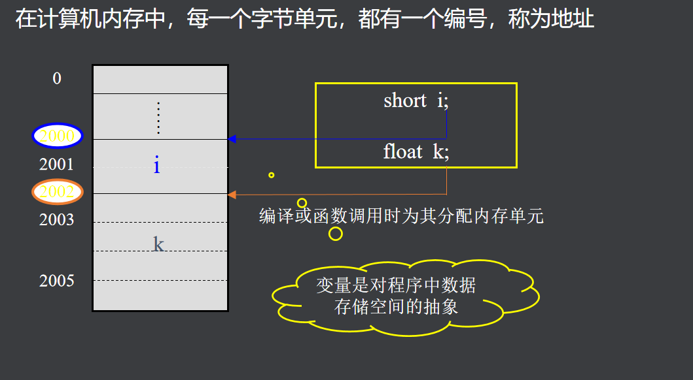

# 指针的基本用法

## 指针  
- 高效简洁  
- 有效地表示复杂的数据结构  
- 动态分配内存  
- 得到多于一个函数返回值  

## 地址和变量  
内存以字节为单位  
  
  
  在C语言中，内存单元的地址称为指针  

## 指针变量的说明   
- <存储类型><数据类型> *<指针变量名>   

### \*符号
1. 定义变量
2. 取内容  

## 思考题
什么叫指针？
> 内存的地址就叫指针，如果存的是变量，就叫指针变量，简称指针。  

指针占几个字节？  
> 在32位系统中，指针占4个字节（32位）。  
> 在64位系统中，指针占8个字节（64位）。