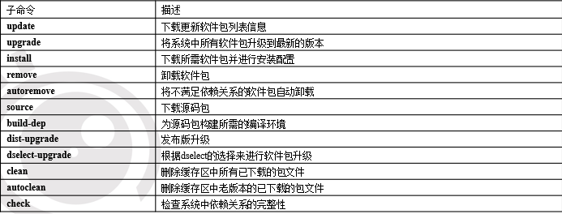

# deb软件包管理  

## 一、dpkg软件包管理  

1. 如何讲Windows的文件放在Ubuntu里面  
    > 直接拖进去  
    > vwware 虚拟机设置>选项>共享文件夹>总是启用> 添加你想共享的文件夹  

2. dpkg相关命令:
   - `dpkg -i <package>`   安装一个在本地文件系统上存在的Debian软件包(只有这个是软件包的名字，其余是软件名就行)  
   - `dpgk -r <package>`   移除一个已经安装的软件包  
   - `dpkg -P <package>`   移除已安装软件包及配置文件  
   - `dpkg -L <package>`   列出安装的软件包清单  
   - `dpkg -s <package>`   显出软件包的安装状态  

3. dpkg和apt软件包管理器有什么区别？  
    >dpkg 需要自己找依赖  不能在线安装  
    >apt 可以在线自己找依赖  

## 二、apt软件管理  

1. 软件源配置文件  
    列出最适合访问的镜像站点地址  
    /ect/apt/sources.list  （只是告知软件源镜像站点的地址）

修改完/ect/apt/sources.list后需要
apt-get update”命令会扫描每一个软件源服务器，并为该服务器所具有软件包资源建立索引文件，  
存放在本地的/var/lib/apt/lists目录中。  

2. 管理软件包  
    apt-get subcommands [-d|-f|-m|-q|--purge|--reinstall|-b|-s|-y|-u|-h|-v] pkg  
      
    - update:更新索引  
    - upgrade:...  
     

3. 修复软件包依赖关系  
安装中断等原因，只安装了部分  

- sudo apt-get check  
- sudo apt-get -f install  
- sudo apt-get update  
- sudp apt-get upgrade  

4. 重新安装软件包  
    使用“apt-get install”下载软件包大体分为四步：
STEP1: 扫描本地存放的软件包更新列表（有apt-get update命令刷新更新列表），找到最新版本的软件包
    STEP2: 进行软件包依赖关系检查，找到支持该软件正常运行的所有软件包；
    STEP3: 从软件源所指的镜像站点中，下载相关软件包；
    STEP4: 解压软件包，并自动完成应用程序的安装和配置。  
    损坏了软件包，需要重装，怎么办？  
    sudo apt-get install rxvt --reinstall  

5. 卸载软件包  
两种卸载方式  

- 不完全卸载  
不完全卸载代码  

```shell
    sudo apt-get remove  
```

> 会关注那些与被删除的软件包相关的其它软件包，删除一个软件包时，将会连带删除与该软件包有依赖关系的软件包。  

- 完全卸载  

```shell
sudo apt-get --purge remove
```  

> 命令在卸载软件包文件的同时，还删除该软件包所使的配置文件。  

6. 请理软件包缓冲区  
   - 目录: /var/cache/apt/archives/  
  
    请理缓冲区命令  

```shell
sudo apt-get clean
```  

7. 查询软件包信息  
使用方式  

> 使用apt-cache命令完成查询软件源和软件包的相关信息。  

**apt-cache subcommands [-p|-s|-q|-i|-c|-h] pkg**  

  

```shell
sudo apt-cache show
```

> 获取指定软件包的详细信息，包括软件包安装状态、优先级、适用架构、版本、存在依赖关系的软件包，以及功能描述。该命令可以同时显现多个软件包的详细信息。  

8. 获取软件包安装状态  
获取软件包当前的安装状态  

```shell  
apt-cache policy
```

1) 如果用户仅想了解某个软件包依赖于哪些软件包，可以使用`apt-cache depends`命令  
2) 如果用户仅想了解某个软件包被哪些软件包所依赖，可以使用`apt-cache rdepends`命令。  

## 三、总结  

1) /ect/apt/sources.list  
2) /var/lib/apt/lists/*  
3) /var/cache/apt/archives  

需要知道这些都是干嘛的  
