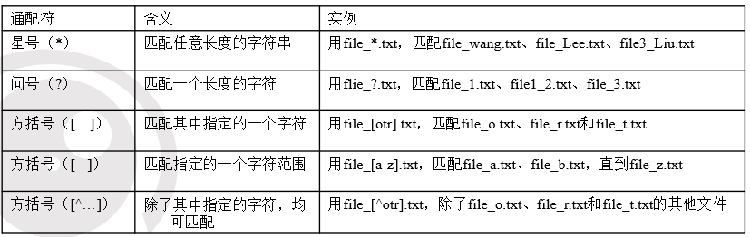
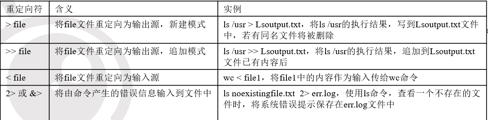
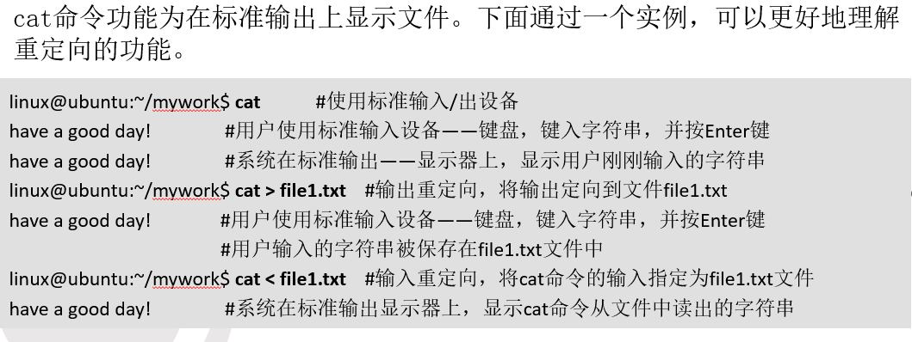

# shell中的特殊字符  

## 一、shell中的通配符  

> 当需要用命令处理一组文件，例如file1.txt、file2.txt、file3.txt……，用户不必一一输入文件名，可以使用shell通配符。  

  
有些是不对的  比较简单  
注意有的是一个字符  

## 二、shell中的管道  

> 管道可以把一系列命令连接起来，意味着第一个命令的输出将作为第二个命令的输入，通过管道传递给第二个命令，第二个命令的输出又将作为第三个命令的输入，以此类推。  

```shell
linux@ubuntu:~$    ls /usr/bin | wc –w
1249
```

: 借助管道“|”，将ls的输出直接作为wc命令的输入。使用管道可以巧妙的将一些命令联合使用，得到单个命令所无法实现的效果。例如使用以上的命令组合，得到的是/usr/bin目录下文件的个数。  

## 三、思考题  

1. shell中有哪些特殊字符?  
2. shell中管道的作用？  
3. shell中grep命令和管道如何结合？  

## 输入输出重定向  

> 改变shell命令或程序默认的标准输入/输出目标，重新定向到新的目标。  

用户可以为当前操作改变输入或输出，迫使某个特定命令的输入或输出来源为外部文件。  

  

cat命令功能为在标准输出上显示文件。
  

## 命令置换  

> 将一个命令的输出作为另一个命令的参数。  

- 其中，命令command2的输出将作为命令command1的参数。需要注意，命令置换的单引号为ESC键下方的“`”键  

```shell 
command1  `command2`
```

- pwd命令用于显示当前目录的绝对路径。在上面的命令行中，使用命令置换符，将pwd的运行结果作为ls命令的参数。最终，命令执行结果是显示当前目录的文件内容。

```shell
linux@ubuntu:~$ ls  `pwd`
Desktop  Examples  historycommandlist  mywork  
ls $(pwd)  
```  

## 总结  

什么叫输入输出重定向?
有哪些输入输出重定向符？
