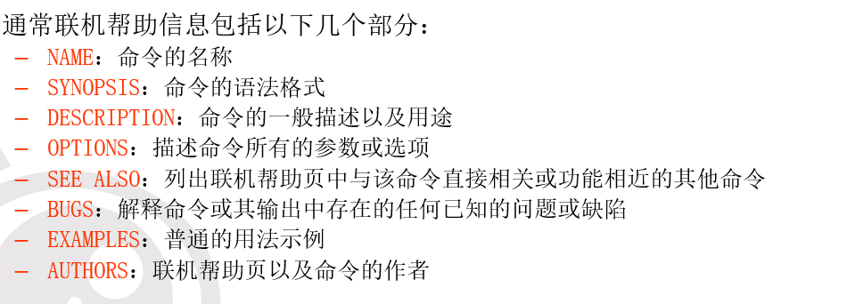

# shell基本系统维护命令  

## 一、man、passwd、su、echo命令的用法  

### man  

> 可以找到特定的联机帮助页，并提供简短的命令说明。  

语法格式为  
man  commandname  

- 联机帮助页提供了指定命令commandname的相关信息，包括：名称、函数、语法以及可选参数描述等。无论帮助有多长，都遵循这个格式显示。在页面很多的情况下使用PageUp和PageDown键翻页。最后，使用“：q”退出帮助页面。

  
[]在语法格式中代表可以省略  
<>不可神略  

### passwd  

> 可以使用passwd命令，为已有账户重新修改用户口令。  

- 超级用户root可以修改所有其他用户的口令，而普通用户只能修改自己的用户口令，如果确要修改超级用户或其他用户口令的话，需要具有超级用户的权限。

一般命令格式  
passwd  username

### su  

> 用于临时改变用户身份，具有其他用户的权限。  

### echo

## 二、date、clear、df、du命令的用法  

### date  

### clear  

### df  

### du  
