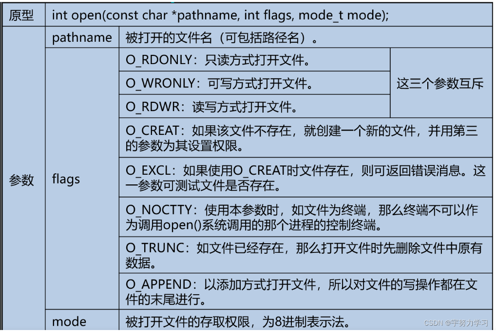

# Liunx下的文件IO 

[相关资料1](https://blog.csdn.net/qq_52479948/article/details/127695382?ops_request_misc=%257B%2522request%255Fid%2522%253A%25226969FB6F-D4DA-4E01-B329-A06DC83D39A4%2522%252C%2522scm%2522%253A%252220140713.130102334..%2522%257D&request_id=6969FB6F-D4DA-4E01-B329-A06DC83D39A4&biz_id=0&utm_medium=distribute.pc_search_result.none-task-blog-2~blog~top_positive~default-1-127695382-null-null.nonecase&utm_term=%E6%96%87%E4%BB%B6iO&spm=1018.2226.3001.4450 )

## 一、和标准IO的区别

|||||
|:---:|:---:|:---:|:--:|
|标准IO|ANSCI|带缓冲|流FILE|
|文件IO |POSIX|无缓冲|文件描述符fd|

## 二、特点  

1. posix(可移植操作系统接口)定义的一组函数
2. 无缓冲机制，所以每次读写操作都需要引起系统调用  
3. 核心概念为文件描述符
4. 可以访问各种类型的文件
5. Linux下，标准IO基于文件IO

## 三、文件描述符  

## 四、相关函数

### 1.open()

```c
#include<fcntl.h>
int open(const *path ,int oflag,...);
```

返回值：

- 成功：返回文件描述符
- 失败：返回EOF

打开文件时

参数：



### 2.close()

```c
#include<unistd.h>
int close(int fd);
```

返回值：

- 成功：返回0
- 失败：返回EOF
- 程序结束时自动关闭所有打开的文件

## 五、如何读取文件read()

```c
#include<unistd.h>
size_t read(int fd,void *bnf,size_t count );
```

返回值：

- 成功：返回实际读取的字节数
- 失败：返回EOF
- 读到末尾：返回0
  
## 六、如何写文件write()

```c
#include<unistd.h>
size_t write 
```

返回值：

- 成功：返回实际写入的字节数
- 失败：返回EOF
  
## 七、lseek()定位函数

```c
#include<unistd.h>
off_t lseek(int fd ,off_t offset,int whence);
```

返回值：

- 成功：返回当前的文件读写位置
- 失败：返回EOF

## 八、例题 

利用文件IO实现文件的复制

```c
#include<stdio.h>
#include<unistd.h>
#include<fcntl.h>
#include<errno.h>
#define N 64
int main(int argc,char *argv[])
{
int fds,fdt,n;
char buff[N];	
if(argc<3)
{
printf("usage: %s <scr_file> <dst_file>\n",argv);
return -1;
}
if((fds=open(argv[1],O_RDONLY))==-1)
{
fprintf(stderr,"open %s : %s\n",argv[1],strerror(errno));	
return -1;
}
if((fdt=open(argv[2],O_WRONLY|O_CREAT|O_TRUNC,0666))==-1)
    {
    fprintf(stderr,"open %s : %s\n",argv[2],strerror(errno));
    return -1;
    }
while((n=read(fds,buff,N))>0)
{
write(fdt,buff,n);
}
close(fds);
close(fdt);
return 0;
}
```
