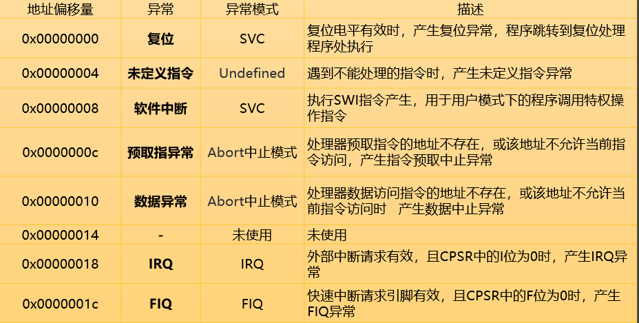
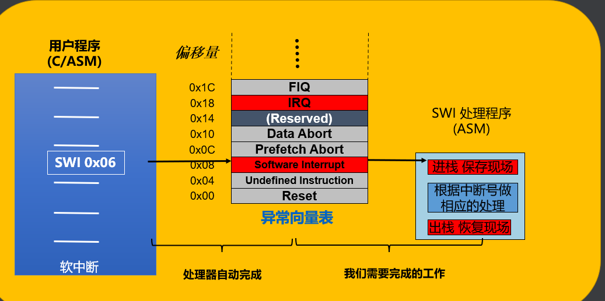

# ARM异常处理

[相关资料1](https://blog.csdn.net/weixin_40167339/article/details/139811633?ops_request_misc=%257B%2522request%255Fid%2522%253A%252264504860-C57F-47B7-B4B0-733881EFEB10%2522%252C%2522scm%2522%253A%252220140713.130102334..%2522%257D&request_id=64504860-C57F-47B7-B4B0-733881EFEB10&biz_id=0&utm_medium=distribute.pc_search_result.none-task-blog-2~blog~sobaiduend~default-1-139811633-null-null.nonecase&utm_term=ARM%E5%BC%82%E5%B8%B8%E5%A4%84%E7%90%86&spm=1018.2226.3001.4450)

> CPU内部产生中断叫异常，外部控制器产生中断叫中断

## 一、认识异常

### 1.异常的种类

|类型|符号|举例|
|:--:|:--:|:--:|
|中断  | IRQ FIQ| 外部硬件触发|
|软中断|Soft interrupt| 系统调用|
|复位     |Reset |如手机死机，按下power键|
|未定义指令|Undefined instruction||
|数据异常|Data about|数据越界|

### 2.异常源

## 二、中断异常

> 有两个外部中断FIQ，IRQ
> 需要有一个中断控制源
> 同时要包含清除中断源的代码

## 三、异常向量表

> 异常向量表（vector tables）是一组存放于普通内存（normal memory）空间的，用于处理不同类型异常的指令（exception handler）。

异常是随机的，软件没法将中断发在合适的位置进行跳转到异常的函数中，所以需要异常向量表，让cpu去处理，去跳转到相应的位置

### 异常与工作模式的关系

复位，软中断  -->SVC
Prefetch，Data Abort   -->About
user systerm 模式不是异常触发切换的，是程序员修改CPSR，实现切换的

## 四、软中断程序

swi

swi运行后，会把下一条的指令的地址，发送给LR，在中断处理函数的最后需要将LR的地址传递给PC，会把User模式切换到SVC模式

保护现场：
如何进栈？
stmfd sp!,{保护的寄存器，保护的位置LR}
如何出栈？
ldmfd sp!,{出栈的寄存器，弹出赋给PC}

