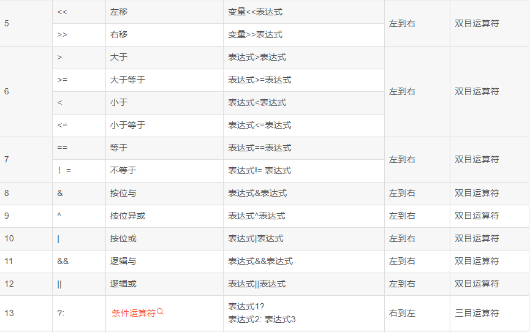

# **运算符**

## **算术运算符**
> +,-,*,/,%,++,--  

注：【float，double两个类型不能取余】

## **关系运算符**
> \>,>=,<,<=,==,!=


## **逻辑运算符**
> &&,||,!  

- if(a&&b&&c)  
短路特性：如果a为假，b和c不会执行。  
- if(a||b||c)  
类似，a为真，b和c不会执行。  

## **位运算符**
> ~,&,|,^,>>,<<  

打印16进制：用%x，%#x代表前面自动加0x符号

^ :异或，相同为0，不同为1。

## **移位运算**
- 一般形式  
<运算量><运算符><表达式>
1. 运算量必须为整型结果数值
2. 运算符为左移位（>>）or右移位（<<）
3. 表达式也必须为整型数值

如何把无符号数某一位快速置1，或者置0？
> 置1或运算，置0与运算


如何把十进制转变到十六进制？  
a/16；a%16   (右移/)（取最后四位%，也可以与上0xF）

## **赋值运算符** 
> +=,-=,*=,/=,%=,&=,|=,^=,>>=,<<=  

## **特殊运算符**
一般形式
- 三目运算符  
<表达式1>?<表达式2>:<表达式3>  
表达式1成立，取2，反之取3

- 逗号运算符
eg：
```
float x=10.5,y=1.8,z=0;
z=(x+=5,y=x+0.2);
```
从左往右，依次运行，取最后的至给z   
运行结果：x=15.5,y=15.7,z=15.7;  

- sizeof()运算符  
sizeof（<类型或者变量名>）

## **C运算符的优先级**
插图！  
  
  

==的优先级要比=高


