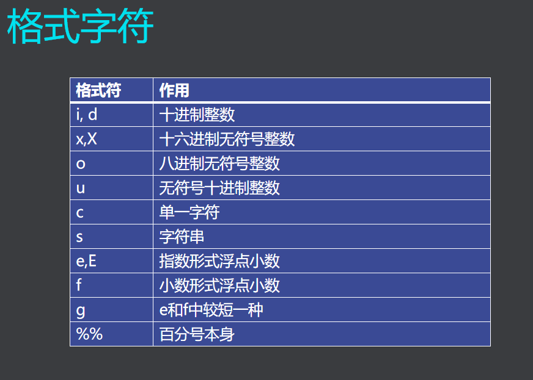

# **输出函数**

## **字符输出函数**
1.C语言的IO接口由函数实现<stio.h>  
- 格式：putchar(c)
- 参数：c为字符常量(ASCII)
- 功能：把字符C输出到显示器上
- 返值：正常，为显示代码值

## **格式输出函数**
- 格式 ：printf("格式控制串"，输出表)  
- 格式字符  
  
- 附加格式说明符  
  
```
#include <stdio.h>
int main() {

        int a = 254;
        float f1 = 345.667;
        printf("%8d\n,%2d\n",a,a);
        printf("%9f\n,%9.2f\n,%.3f",f1,f1,f1);
        return 0;
}
```
第一个a有五个空格，第二个a原样输出  


