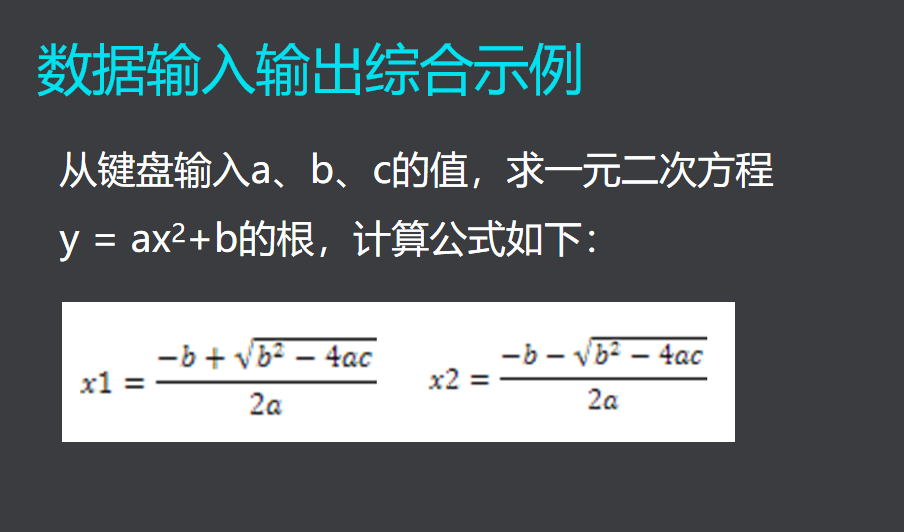

# **输入函数留下的垃圾**

## **遗留的回车**
```
#include <stdio.h>
int main()
{
	int a ;
	char x;
	printf(">");
	scanf("%d",&a);
	scanf("%c",&x);
	printf("%d:%c:%d\n",a,x,x);
	return 0;
}
```
输出结果：
```
>5
5:
:10
```
- 如何去处理遗留的回车？
1. 用getchar()函数清除 
2. 用格式符"%*c"来吃掉[```scanf(" %c",&ch);或者scanf("%*c%c,&ch);```]

## **字符串输入函数**
- 格式：char * gets(char *s)
- 功能：从键盘输入一以回车结束的字符串放入数组中，并自动加‘0’
- 说明1：输入串长度应小于字符数组维数
- 说明2：与scanf函数不同，gets函数并不以空格作为字符串输入结束的标志。scanf会这么干！

gets函数为什么是危险的？
- 可能会出现栈溢出  

## **字符串输出函数**
- 格式：int puts(const char *s)
- 功能：向显示器输出字符串（输出完，换行）
- 说明：字符串数组必须以'\0'结束

## **作业**


```
#include<stdio.h>
#include<math.h>
int main()
{
	float a,b,c;
	float x1,x2;
	printf(">");
	scanf("%f,%f,%f",&a,&b,&c);
	x1=(-b+sqrt(b*b-4*a*c))/(2*a);
	x2=(-b-sqrt(b*b-4*a*c))/(2*a);
	printf("x1=%f,x2=%f",x1,x2);
	return 0;
}

```
不对，自己去查一下课后！