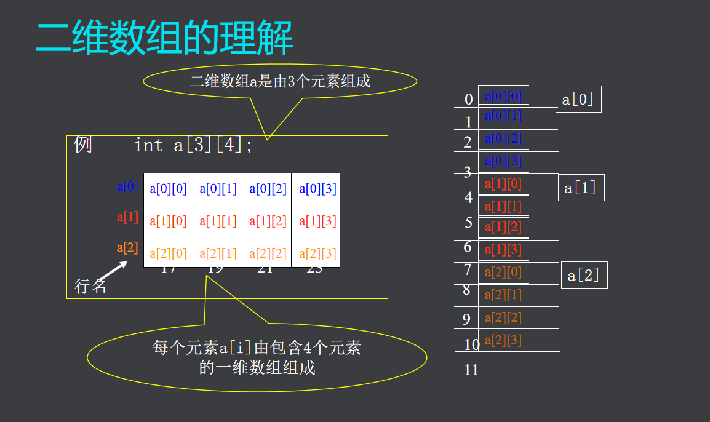
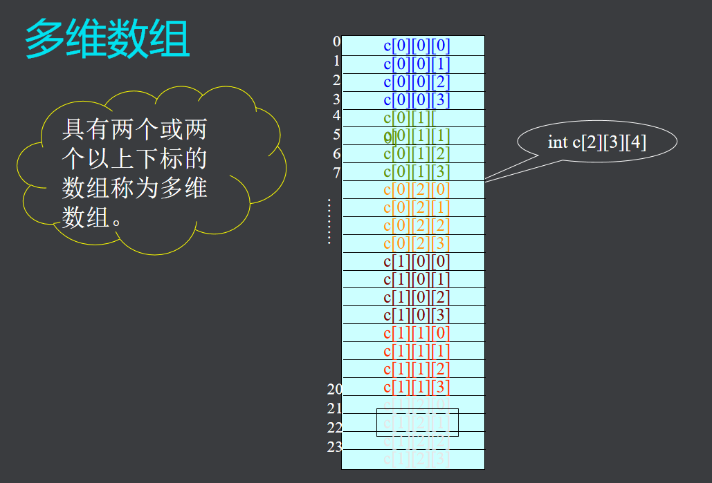
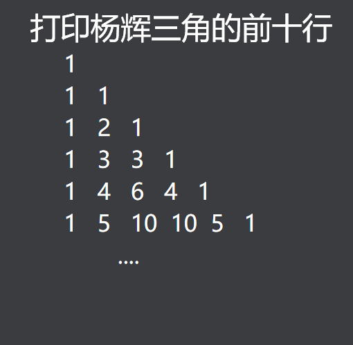

# **二维数组**

## 定义
- 格式：数据类型 数组名 [常量表达式][常量表达式];

## 存储特点
- 内存是一维的
- 按行序优先

int a[3][2]
分析：
1. 三行两列数组
2. a[0][0]~a[2][1]

对二维数组的理解

  

四个元素其实是一个一维数组

## 二维数组的引用
1. 形式：数组名[下标][下标]
2. 初始化
    - 分行初始化
    - 按元素排列顺序初始化
    - eg：int a[2][3]={{1,2},{4}}  
    1,2,0,4,0,0;  

注意：
1. 一般定义用{}里面嵌入{}；
2. 可以省略多少行，不可以省略**列数**；

## 多维数组
> 具有两个或两个以上下标的数组称为多维数组  

  

## 程序举例
杨辉三角题目  
  

```

```