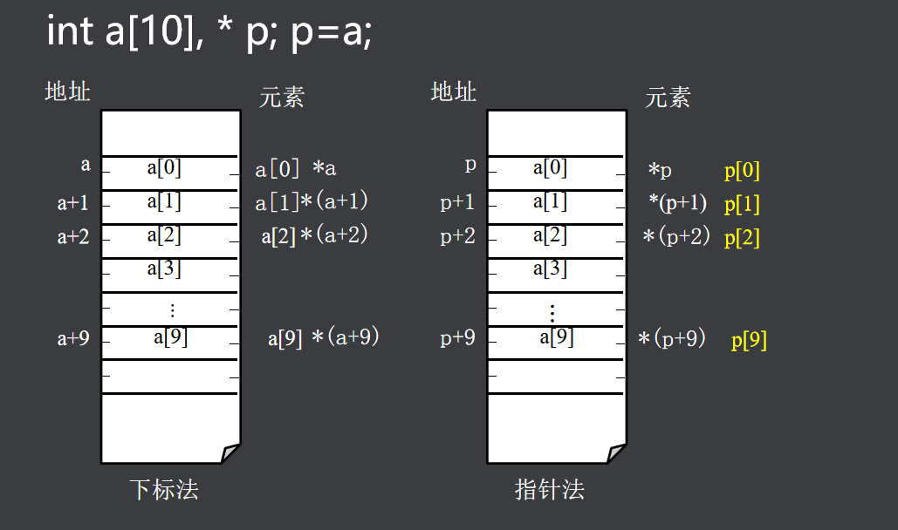

# 指针与数组  

x[i]、\*(px+i)、\*(x+i)和px[i]具有完全相同的功能：访问数组第i+1个数组元素。  
  

题目  
  
```
#include <stdio.h>
int main()
{
	int a[7]={1,6,9,12,61,23,21};
	int *p,*q;
	int t,i;	
	p=a;
	q=&a[6];
while(p<q)
{
	t=*p;
	*p=*q;
	*q=t;
	p++;
	q--;
}
p=a;
for(i=0;i<7;i++)
	printf("%d\n",a[i]);
return 0;
}
```  
